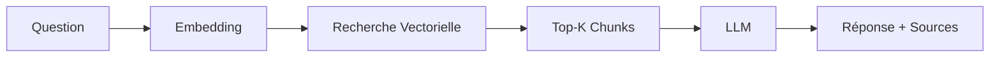

# 🤖 Application RAG - Règlement Technique

Application de Question-Réponse intelligente basée sur le système RAG (Retrieval-Augmented Generation) pour interroger le règlement technique.

## 📋 Caractéristiques

- ✅ **Recherche sémantique** : Utilise SentenceTransformers pour comprendre le sens des questions
- ✅ **Base de données vectorielle** : ChromaDB pour un stockage et une recherche efficaces
- ✅ **LLM local** : Llama 3.2 via Ollama pour des réponses intelligentes
- ✅ **Interface moderne** : Gradio pour une expérience utilisateur intuitive
- ✅ **Déploiement Docker** : Conteneurisation complète avec docker-compose
- ✅ **Support multilingue** : Français et Russe

## 🏗️ Architecture

```
rag-app/
├── app.py                  # Application Gradio principale
├── rag_system.py          # Système RAG (embeddings, ChromaDB, LLM)
├── chunking.py            # Parsing et chunking du règlement
├── init_database.py       # Initialisation de la base de données
├── requirements.txt       # Dépendances Python
├── Dockerfile            # Image Docker de l'application
├── docker-compose.yml    # Configuration multi-conteneurs
├── .gitignore           # Fichiers à ignorer
├── data/                # Données (règlement, chunks, ChromaDB)
└── models/              # Modèles téléchargés
```

## 🚀 Installation

### Option 1 : Avec Docker (Recommandé)

#### Prérequis
- Docker Desktop installé
- Docker Compose installé
- 8 GB RAM minimum

#### Étapes

1. **Cloner le dépôt ou naviguer vers le dossier**
   ```bash
   cd rag-app
   ```

2. **Télécharger le règlement** (si pas déjà fait)
   ```bash
   # Placez votre fichier regulation.txt dans le dossier data/
   # Ou exécutez le script d'initialisation (voir ci-dessous)
   ```

3. **Lancer l'application avec Docker Compose**
   ```bash
   docker-compose up --build
   ```

   Cette commande va :
   - Construire l'image Docker de l'application
   - Démarrer le conteneur Ollama
   - Télécharger le modèle Llama 3.2
   - Démarrer l'application Gradio

4. **Accéder à l'application**
   - Ouvrez votre navigateur : http://localhost:7860
   - L'application est prête à l'emploi !

### Option 2 : Installation Locale

#### Prérequis
- Python 3.10+
- Ollama installé ([https://ollama.ai](https://ollama.ai))

#### Étapes

1. **Installer les dépendances**
   ```bash
   pip install -r requirements.txt
   ```

2. **Télécharger le modèle Llama 3.2**
   ```bash
   ollama pull llama3.2:latest
   ```

3. **Initialiser la base de données**
   ```bash
   python init_database.py
   ```

   Ce script va :
   - Télécharger le règlement depuis Google Drive
   - Le parser en chunks structurés
   - Créer les embeddings
   - Indexer dans ChromaDB

4. **Lancer l'application**
   ```bash
   python app.py
   ```

5. **Accéder à l'application**
   - Ouvrez votre navigateur : http://localhost:7860

## 📖 Utilisation

### Interface Web

1. **Posez une question** dans la zone de texte
2. **Attendez la réponse** (streaming en temps réel)
3. **Consultez les sources** citées avec les articles et points référencés

### Exemples de questions

```
🇷🇺 Russe:
- "Что говорится в статье 5 о требованиях безопасности?"
- "Какие документы необходимы для подтверждения соответствия?"
- "Как осуществляется маркировка продукции?"

🇫🇷 Français:
- "Quelles sont les exigences de sécurité pour les produits?"
- "Comment s'effectue la certification?"
- "Quels sont les documents requis?"
```

### API Python

```python
from rag_system import RAGSystem

# Initialiser le système
rag = RAGSystem()

# Charger et indexer le règlement
chunks = rag.load_regulation("data/regulation.txt")
rag.index_chunks(chunks)

# Poser une question
response = rag.query("Что говорится о безопасности?")
print(response)

# Avec streaming
for token in rag.query_streaming("Quelles sont les exigences?"):
    print(token, end="", flush=True)
```

## 🔧 Configuration

### Variables d'environnement

```bash
# Hôte Ollama (pour Docker)
OLLAMA_HOST=http://ollama:11434

# Configuration Gradio
GRADIO_SERVER_NAME=0.0.0.0
GRADIO_SERVER_PORT=7860
```

### Personnalisation du système RAG

Dans [rag_system.py](rag_system.py), vous pouvez modifier :

```python
RAGSystem(
    embedding_model='multi-qa-mpnet-base-dot-v1',  # Modèle d'embeddings
    llm_model='llama3.2:latest',                    # Modèle LLM
    chroma_db_path='./data/chroma_db'              # Chemin ChromaDB
)
```

## 📊 Méthode de Chunking

Le système utilise une méthode de chunking structurée basée sur la structure du règlement :

1. **Identification des articles** : Extraction des numéros et titres d'articles
2. **Découpage par points** : Chaque point devient un chunk
3. **Métadonnées riches** : 
   - ID du chunk (ex: "5.3" pour Article 5, Point 3)
   - Numéro d'article
   - Titre d'article
   - Numéro de point
   - Texte complet

Cette méthode préserve la structure hiérarchique du règlement et facilite les citations précises.

## 🔍 Workflow RAG



1. **Question** → Transformation en embedding vectoriel
2. **Recherche** → Comparaison avec les embeddings des chunks
3. **Récupération** → Top-K chunks les plus pertinents
4. **Génération** → LLM génère une réponse basée sur le contexte
5. **Formatage** → Réponse + citations des sources

## 🐳 Commandes Docker Utiles

```bash
# Démarrer l'application
docker-compose up

# Démarrer en arrière-plan
docker-compose up -d

# Voir les logs
docker-compose logs -f

# Arrêter l'application
docker-compose down

# Reconstruire les images
docker-compose build --no-cache

# Supprimer volumes et tout reconstruire
docker-compose down -v
docker-compose up --build
```

## 🛠️ Résolution de Problèmes

### L'application ne démarre pas

1. Vérifier que Docker Desktop est en cours d'exécution
2. Vérifier les ports 7860 et 11434 sont disponibles
3. Vérifier les logs : `docker-compose logs`

### Ollama ne répond pas

```bash
# Vérifier le statut
docker-compose ps

# Redémarrer Ollama
docker-compose restart ollama
```

### ChromaDB vide

```bash
# Réinitialiser la base de données
python init_database.py
```

### Problèmes de mémoire

- Minimum 8 GB RAM requis
- Augmenter la mémoire allouée à Docker Desktop

## 📦 Structure des Données

```
data/
├── regulation.txt          # Règlement technique original
├── chunks.txt             # Chunks formatés avec métadonnées
└── chroma_db/            # Base de données vectorielle ChromaDB
    ├── chroma.sqlite3
    └── ...
```

## 🤝 Contribution

Les contributions sont les bienvenues ! N'hésitez pas à :

1. Fork le projet
2. Créer une branche (`git checkout -b feature/amelioration`)
3. Commit vos changements (`git commit -m 'Ajout de fonctionnalité'`)
4. Push vers la branche (`git push origin feature/amelioration`)
5. Ouvrir une Pull Request

## 📝 Licence

Ce projet est distribué sous licence MIT.

## 👥 Auteurs

- Développé en utilisant les méthodes des notebooks :
  - `Локальные_модели_для_формирования_эмбеддингов_и_векторные_БД (2).ipynb`
  - `rag-llama3-2-gradio.ipynb`

## 🙏 Remerciements

- **SentenceTransformers** pour les embeddings
- **ChromaDB** pour la base vectorielle
- **Ollama** pour l'hébergement local des LLM
- **Gradio** pour l'interface utilisateur
- **LangChain** pour l'orchestration RAG

## 📞 Support

Pour toute question ou problème, veuillez ouvrir une issue sur GitHub.

---

**Fait avec ❤️ et 🤖 IA**
